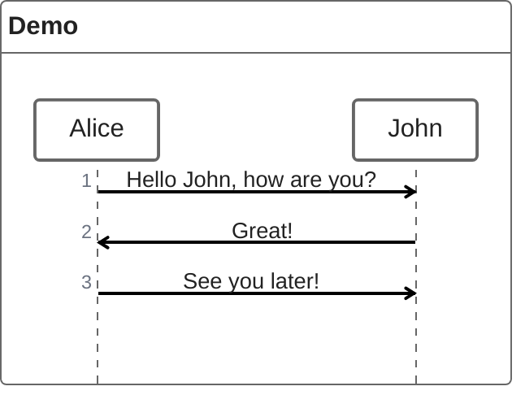
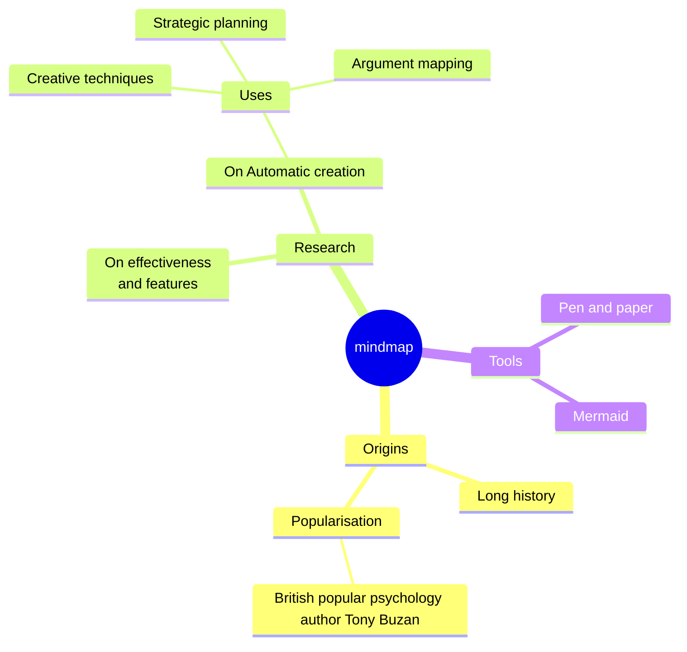

# Configuration

Configuration for `yardang` is driven from the `pyproject.toml`, either via standard sections like `project` or from the dedicated `tool.yardang` section.
Each option below corresponds to the [Sphinx configuration](https://www.sphinx-doc.org/en/master/usage/configuration.html).

Here is `yardang`'s own configuration, in `pyproject.toml`

```toml
[tool.yardang]
root = "docs/src/home.md"
cname = "yardang.python-templates.dev"
pages = [
    "docs/src/overview.md",
    "docs/src/installation.md",
    "docs/src/configuration.md",
]
use-autoapi = true
```
## [`name`](https://www.sphinx-doc.org/en/master/usage/configuration.html#confval-project)

The project name is taken from the standard section, or from the `cwd`.

```toml
[project]
name = "your project name"
```

## `title`

Same as `name`

## `module`

The module title is taken from the `name`, replacing `-` with `_`, or from the `cwd` doing the same.

## `description`

```toml
[project]
description = "your project description"
```

## [`author`](https://www.sphinx-doc.org/en/master/usage/configuration.html#confval-author)

```toml
[project]
authors = "your project authors"
```

## [`version`](https://www.sphinx-doc.org/en/master/usage/configuration.html#confval-version)

```toml
[project]
version = "0.1.0"
```

## `theme`

Defaults to `furo`.

```toml
[tool.yardang]
theme = "furo"
```

## [`theme`](https://www.sphinx-doc.org/en/master/usage/configuration.html#confval-html_theme)

Defaults to `furo`.

```toml
[tool.yardang]
theme = "furo"
```

## `root`

The root page to use, defaults to `README.md`.

```toml
[tool.yardang]
root = "docs/src/index.md"
```

## `cname`

If set, will generate a `CNAME` file for GitHub Pages custom domains.

```toml
[tool.yardang]
cname = "yardang.python-templates.dev"
```

## `pages`

Pages to include in the contents tree.

```toml
[tool.yardang]
pages = [
    "docs/src/overview.md",
    "docs/src/installation.md",
    "docs/src/configuration.md",
]
```

## `use_autoapi`

Whether or not to use [Sphinx AutoAPI](https://sphinx-autoapi.readthedocs.io/en/latest/).
**NOTE:** it is recommended to manually autodoc your code.

```toml
[tool.yardang]
use-autoapi = true
```

## Sphinx Options

```toml
[tool.yardang]
html_theme_options = {}
html_static_path = []
html_css_files = []
html_js_files = []
source_suffix = []
exclude_patterns = []
language = "en"
pygments_style = "sphinx"
```


## [Myst](https://myst-parser.readthedocs.io/en/latest/#)

```toml
[tool.yardang]
myst_enable_extensions = ["amsmath", "colon_fence", "dollarmath", "html_image"]
myst_fence_as_directive = ["mermaid"]
```

## [Myst-NB](https://myst-nb.readthedocs.io/en/latest/#)

```toml
[tool.yardang]
nb_execution_mode = "off"
nb_execution_excludepatterns = []
```

Notebooks can be included with:

````raw
```{eval-rst}
.. toctree::
  :maxdepth: 1

  ../notebooks/example
```
````

An example follows:

```{eval-rst}
.. toctree::
  :maxdepth: 1

  ../notebooks/example
```

## [Autodoc Pydantic](https://autodoc-pydantic.readthedocs.io/en/stable/users/examples.html) arguments

[Configuration for Autodoc Pydantic](https://autodoc-pydantic.readthedocs.io/en/stable/users/configuration.html).

```toml
[tool.yardang]
autodoc_pydantic_model_show_config_summary = false
autodoc_pydantic_model_show_validator_summary = false
autodoc_pydantic_model_show_validator_members = false
autodoc_pydantic_field_list_validators = false
autodoc_pydantic_field_show_constraints = false
autodoc_pydantic_model_member_order = "bysource"
autodoc_pydantic_model_show_json = true
autodoc_pydantic_settings_show_json = false
autodoc_pydantic_model_show_field_summary = false
```

## Mermaid







## GitHub Admonitions

GitHub admonitions are automatically translated to sphinx.

> [!NOTE]
> Note `markdown` content

> [!TIP]
> Tip content

> [!IMPORTANT]
> Important content

> [!WARNING]
> Warning content

> [!CAUTION]
> Caution content

## Breathe/Doxygen Integration

Yardang provides integration with [Breathe](https://breathe.readthedocs.io/) for documenting C/C++ code using Doxygen. To use this feature, install yardang with the breathe extra:

```bash
pip install yardang[breathe]
```

All breathe configuration is under `[tool.yardang.breathe]`.

### `projects`

A dictionary mapping project names to their Doxygen XML output directories.

```toml
[tool.yardang.breathe]
projects = { myproject = "docs/doxygen/xml", another = "path/to/xml" }
```

### `default-project`

The default project to use when no project is specified in breathe directives.

```toml
[tool.yardang.breathe]
default-project = "myproject"
```

### `domain-by-extension`

Map file extensions to Sphinx domains.

```toml
[tool.yardang.breathe]
domain-by-extension = { "hpp" = "cpp", "h" = "cpp", "py" = "py" }
```

### `domain-by-file-pattern`

Map file patterns to Sphinx domains.

```toml
[tool.yardang.breathe]
domain-by-file-pattern = { "*.hpp" = "cpp" }
```

### `projects-source`

Configure source files for automatic Doxygen XML generation.

```toml
[tool.yardang.breathe]
projects-source = { auto = ["src", ["file1.hpp", "file2.hpp"]] }
```

### `build-directory`

The directory where Doxygen XML is built.

```toml
[tool.yardang.breathe]
build-directory = "build/doxygen"
```

### `default-members`

Default member visibility for doxygenclass directives.

```toml
[tool.yardang.breathe]
default-members = ["members", "protected-members", "private-members"]
```

### `show-define-initializer`

Show the initializer value for #define macros.

```toml
[tool.yardang.breathe]
show-define-initializer = true
```

### `show-enumvalue-initializer`

Show the initializer value for enum values.

```toml
[tool.yardang.breathe]
show-enumvalue-initializer = true
```

### `show-include`

Show the #include directive for documented entities.

```toml
[tool.yardang.breathe]
show-include = true
```

### `implementation-filename-extensions`

List of file extensions considered as implementation files.

```toml
[tool.yardang.breathe]
implementation-filename-extensions = [".c", ".cc", ".cpp"]
```

### `doxygen-config-options`

Additional Doxygen configuration options for auto-generated XML.

```toml
[tool.yardang.breathe]
doxygen-config-options = { EXTRACT_ALL = "YES", QUIET = "YES" }
```

### `doxygen-aliases`

Doxygen aliases for custom commands.

```toml
[tool.yardang.breathe]
doxygen-aliases = { "myalias" = "Custom documentation text" }
```

### `use-project-refids`

Use project-qualified reference IDs to avoid conflicts.

```toml
[tool.yardang.breathe]
use-project-refids = true
```

### `order-parameters-first`

Order function parameters before other members in documentation.

```toml
[tool.yardang.breathe]
order-parameters-first = true
```

### `separate-member-pages`

Generate separate pages for each class member.

```toml
[tool.yardang.breathe]
separate-member-pages = false
```

### Complete Example

Here's a complete example configuration for a C++ project:

```toml
[tool.yardang]
title = "My C++ Library"
root = "docs/index.md"
pages = ["docs/api.md", "docs/examples.md"]
use-autoapi = false

[tool.yardang.breathe]
projects = { mylib = "docs/doxygen/xml" }
default-project = "mylib"
domain-by-extension = { "hpp" = "cpp", "cpp" = "cpp", "h" = "cpp" }
show-define-initializer = true
show-enumvalue-initializer = true
show-include = true
use-project-refids = true
```

Then in your documentation files, you can use breathe directives:

```markdown
# API Reference

## MyClass

\`\`\`{doxygenclass} MyNamespace::MyClass
:members:
:protected-members:
\`\`\`

## Functions

\`\`\`{doxygenfunction} MyNamespace::myFunction
\`\`\`
```

## Sphinx-Rust Integration

Yardang provides integration with [sphinx-rust](https://sphinx-rust.readthedocs.io/) for documenting Rust code. To use this feature, install yardang with the sphinx-rust extra:

```bash
pip install yardang[sphinx-rust]
```

All sphinx-rust configuration is under `[tool.yardang.sphinx-rust]`.

### `crates`

A list of paths to Rust crates to document.

```toml
[tool.yardang.sphinx-rust]
crates = [
    "path/to/crate1",
    "path/to/crate2",
]
```

### `doc-formats`

A dictionary mapping crate names to their docstring format. Valid values are `"restructuredtext"` (default) or `"myst-nb"` (for markdown docstrings).

```toml
[tool.yardang.sphinx-rust]
doc-formats = { mycrate = "myst-nb" }
```

**Note:** When using `myst_nb` as your Sphinx parser (which yardang uses by default), use `"myst-nb"` instead of `"markdown"` for markdown docstrings.

### `viewcode`

Enable links to the source code for documented items. Defaults to `true`.

```toml
[tool.yardang.sphinx-rust]
viewcode = true
```

### Complete Example

Here's a complete example configuration for a Rust project:

```toml
[tool.yardang]
title = "My Rust Library"
root = "docs/index.md"
pages = ["docs/api.md", "docs/examples.md"]
use-autoapi = false

[tool.yardang.sphinx-rust]
crates = [
    "crates/mylib",
    "crates/mylib-utils",
]
doc-formats = { mylib = "myst-nb", "mylib-utils" = "restructuredtext" }
viewcode = true
```

Then in your documentation files, you can use sphinx-rust directives:

````markdown
# API Reference

## Document a Crate

\`\`\`{eval-rst}
.. rust:crate:: mylib

\`\`\`

## Document Individual Items

\`\`\`{eval-rst}
.. rust:struct:: mylib::MyStruct

\`\`\`

\`\`\`{eval-rst}
.. rust:enum:: mylib::MyEnum

\`\`\`

\`\`\`{eval-rst}
.. rust:function:: mylib::my_function

\`\`\`
````
