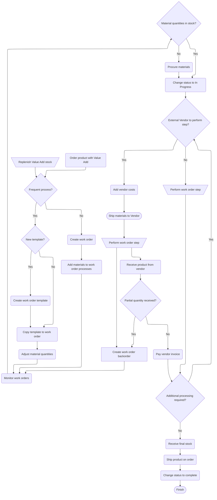

# Configuration

Configuration for `yardang` is driven from the `pyproject.toml`, either via standard sections like `project` or from the dedicated `tool.yardang` section.
Each option below corresponds to the [Sphinx configuration](https://www.sphinx-doc.org/en/master/usage/configuration.html).

Here is `yardang`'s own configuration, in `pyproject.toml`

```toml
[tool.yardang]
root = "docs/src/home.md"
cname = "yardang.python-templates.dev"
pages = [
    "docs/src/overview.md",
    "docs/src/installation.md",
    "docs/src/configuration.md",
]
use-autoapi = true
```
## [`name`](https://www.sphinx-doc.org/en/master/usage/configuration.html#confval-project)

The project name is taken from the standard section, or from the `cwd`.

```toml
[project]
name = "your project name"
```

## `title`

Same as `name`

## `module`

The module title is taken from the `name`, replacing `-` with `_`, or from the `cwd` doing the same.

## `description`

```toml
[project]
description = "your project description"
```

## [`author`](https://www.sphinx-doc.org/en/master/usage/configuration.html#confval-author)

```toml
[project]
authors = "your project authors"
```

## [`version`](https://www.sphinx-doc.org/en/master/usage/configuration.html#confval-version)

```toml
[project]
version = "0.1.0"
```

## `theme`

Defaults to `furo`.

```toml
[tool.yardang]
theme = "furo"
```

## [`theme`](https://www.sphinx-doc.org/en/master/usage/configuration.html#confval-html_theme)

Defaults to `furo`.

```toml
[tool.yardang]
theme = "furo"
```

## `root`

The root page to use, defaults to `README.md`.

```toml
[tool.yardang]
root = "docs/src/index.md"
```

## `cname`

If set, will generate a `CNAME` file for GitHub Pages custom domains.

```toml
[tool.yardang]
cname = "yardang.python-templates.dev"
```

## `pages`

Pages to include in the contents tree.

```toml
[tool.yardang]
pages = [
    "docs/src/overview.md",
    "docs/src/installation.md",
    "docs/src/configuration.md",
]
```

## `use_autoapi`

Whether or not to use [Sphinx AutoAPI](https://sphinx-autoapi.readthedocs.io/en/latest/).
**NOTE:** it is recommended to manually autodoc your code.

```toml
[tool.yardang]
use-autoapi = true
```

## Sphinx Options

```toml
[tool.yardang]
html_theme_options = {}
html_static_path = []
html_css_files = []
html_js_files = []
source_suffix = []
exclude_patterns = []
language = "en"
pygments_style = "sphinx"
```


## [Myst](https://myst-parser.readthedocs.io/en/latest/#)

```toml
[tool.yardang]
myst_enable_extensions = ["amsmath", "colon_fence", "dollarmath", "html_image"]
myst_fence_as_directive = ["mermaid"]
```

## [Myst-NB](https://myst-nb.readthedocs.io/en/latest/#)

```toml
[tool.yardang]
nb_execution_mode = "off"
nb_execution_excludepatterns = []
```

Notebooks can be included with:

````raw
```{eval-rst}
.. toctree::
  :maxdepth: 1

  ../notebooks/example
```
````

An example follows:

```{eval-rst}
.. toctree::
  :maxdepth: 1

  ../notebooks/example
```

## [Autodoc Pydantic](https://autodoc-pydantic.readthedocs.io/en/stable/users/examples.html) arguments

[Configuration for Autodoc Pydantic](https://autodoc-pydantic.readthedocs.io/en/stable/users/configuration.html).

```toml
[tool.yardang]
autodoc_pydantic_model_show_config_summary = false
autodoc_pydantic_model_show_validator_summary = false
autodoc_pydantic_model_show_validator_members = false
autodoc_pydantic_field_list_validators = false
autodoc_pydantic_field_show_constraints = false
autodoc_pydantic_model_member_order = "bysource"
autodoc_pydantic_model_show_json = true
autodoc_pydantic_settings_show_json = false
autodoc_pydantic_model_show_field_summary = false
```

## Mermaid




## GitHub Admonitions

GitHub admonitions are automatically translated to sphinx.

> [!NOTE]
> Note `markdown` content

> [!TIP]
> Tip content

> [!IMPORTANT]
> Important content

> [!WARNING]
> Warning content

> [!CAUTION]
> Caution content

